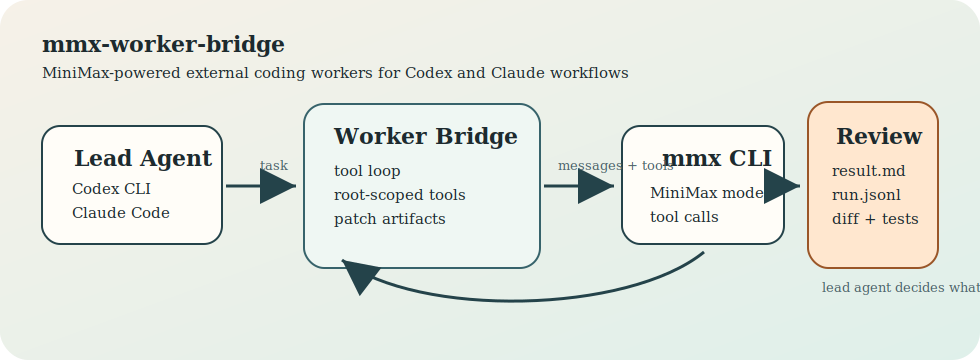
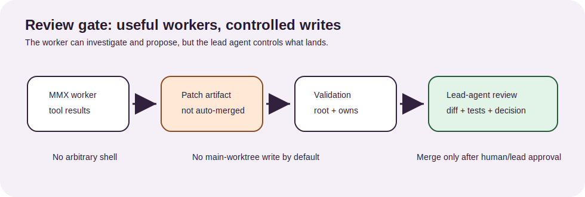

# mmx-worker-bridge

[English](README_en.md) | [中文](README.md)

[](https://www.python.org/)
[](LICENSE)
[](tests/)
[](https://docs.python.org/3/library/dataclasses.html)

**Sandboxed multi-agent orchestration bridge** — delegates bounded coding tasks to MiniMax as an external worker, with lead-agent review gates, git worktree isolation, and patch-based code review.



---

## ⚠️ Background & Current Status

> **TL;DR**: With **Pi Agent** now available, this project isn't that useful anymore.
>
> I built this back when MiniMax charged by **API call count**. Calls were abundant and cheap, so it made sense to use MiniMax as a "grunt worker" — handling legacy code cleanup, batch refactoring, and tedious repetitive tasks. The "lead agent + external worker" pattern worked well at the time.
>
> But things have changed:
> 1. **Pi Agent** came out — building multi-agent systems is now faster and better with it
> 2. **MiniMax switched to token-based billing** instead of per-call billing, so the "more calls = cheaper" advantage is gone
> 3. In practice, using Pi Agent directly gives way better results than this bridge approach
>
> **Why keep this project around?**
> - Some design patterns in the code are still worth looking at — path sandboxing, patch validation, ownership conflict detection
> - It's a case study showing how API pricing models (per-call vs. per-token) affect architectural choices
> - Good for learning how multi-agent orchestration works
>
> If you're building something similar today, just use Pi Agent or other modern multi-agent frameworks. Don't use this.

---

## What This Is

Basically, this wraps MiniMax's `mmx` CLI as a **sandboxed external worker**.

The problem: Claude Code and Codex CLI work great as lead agents, but managing multi-provider credentials is a pain, and letting AI run fully autonomous is risky. So I made this bridge:

- Worker runs in a limited directory scope, can only use restricted tools (read files, search, run read-only commands)
- Every operation generates reviewable artifacts (`result.md`, `run.jsonl`, `proposed_patches/`)
- To modify files, you have to go through a patch workflow — lead agent approves before applying
- Write operations must happen in a git worktree, you need to declare owned paths, and `git apply --check` must pass

**The idea**: MiniMax is actually pretty good at bounded sub-tasks with strong instruction following, so it's better suited as a delegated worker than a main session agent. This bridge uses that strength while keeping human-in-the-loop review at every write boundary.

---

## Features

| Feature | What It Does |
|---------|-------------|
| **Sandboxed Execution** | File ops limited to specified directory, prevents shell injection and path traversal |
| **Review Gate** | All code changes need lead agent approval before applying |
| **Git Worktree Isolation** | Write ops happen in separate branches, won't touch main worktree |
| **Path Ownership** | Batch tasks declare owned paths, conflicts cause errors |
| **Tool Loop** | Multi-step ops: read files, search, list dirs, run commands, propose patches, give final answer |
| **Batch Execution** | Run multiple tasks in parallel, has conflict detection and dry-run |
| **Retry with Backoff** | Auto-retries on mmx failures with exponential backoff |
| **Artifact Output** | Each run generates `result.md`, `run.jsonl`, patch files, etc. |

---

## How It Works

### Agent Loop

```
┌─────────────────────────────────────────────────────────────┐
│  Lead Agent (Claude / Codex)                                │
│  ├─ Delegates task to worker                                │
│  ├─ Reviews artifacts (result.md, patches, git diff)        │
│  └─ Decides: apply / reject / ask worker to change          │
└──────────────────────────────┬──────────────────────────────┘
                               │ task prompt
                               ▼
┌─────────────────────────────────────────────────────────────┐
│  mmx-worker-bridge                                          │
│  ├─ Builds system prompt with tool schemas                  │
│  ├─ Calls mmx text chat                                     │
│  ├─ Parses tool_use responses                               │
│  ├─ Executes tools in sandbox                               │
│  ├─ Feeds results back to mmx                               │
│  └─ Loops until final_answer or max steps                   │
└──────────────────────────────┬──────────────────────────────┘
                               │ mmx CLI
                               ▼
┌─────────────────────────────────────────────────────────────┐
│  MiniMax API (credentials managed by mmx auth)              │
└─────────────────────────────────────────────────────────────┘
```

### Write Permissions

| Mode | Available Tools | Can Write Files? |
|------|----------------|------------------|
| **Default (read-only)** | read files, search, list dirs, run read-only commands, propose patches, give answer | No — patches just saved as artifacts |
| **Controlled write** | All above + apply_patch | Only in git worktree, only for declared owned paths, and `git apply --check` must pass |

---

## Project Structure

```
mmx-worker-bridge/
├── src/
│   └── mmx_worker_bridge/
│       ├── __init__.py          # Public API exports
│       ├── cli.py               # CLI entry point
│       ├── core.py              # Worker loop, tools, batch, worktree (~1400 LOC)
│       ├── client.py            # mmx CLI client wrapper
│       ├── worker.py            # MmxWorker re-exports
│       ├── batch.py             # Batch execution re-exports
│       ├── worktree.py          # Git worktree isolation re-exports
│       ├── patch_review.py      # Patch review re-exports
│       └── tools.py             # Tool schema definitions
├── tests/
│   └── test_bridge.py           # 31 tests covering security, patches, batch, worktree
├── docs/
│   ├── assets/                  # Architecture diagrams (SVG)
│   ├── safety.md                # Safety model documentation
│   ├── claude.md                # Claude Code integration guide
│   ├── codex.md                 # Codex CLI integration guide
│   ├── examples.md              # Usage examples
│   └── release.md               # Release process
├── examples/
│   ├── claude-workflow/         # AGENTS.md policy block example
│   └── codex-skill/             # Codex skill configuration
├── pyproject.toml               # PEP 621 project metadata
├── LICENSE                      # MIT License
└── README_en.md                 # This file
```

---

## Technical Details

- **Zero external dependencies** — pure Python 3.11+ stdlib, just used `dataclasses`, `subprocess`, `concurrent.futures`, `pathlib` and stuff
- **Protocol-oriented design** — `CompletionClient` is a Protocol, easy to mock for testing, can swap backends
- **Security-first** — `run_command` rejects shell metacharacters (`&|;<>`\`()`), paths outside root, and write-oriented commands
- **Patch validation flow** — parse unified diff → check if in root → check ownership → `git apply --check` → actually apply
- **Batch conflict detection** — checks for path ownership overlaps before running
- **Windows compatible** — handles `.CMD`/`.BAT` shims via `PATHEXT` resolution

---

## Requirements

- Python 3.11 or newer
- Git
- The MiniMax `mmx` CLI installed and authenticated

```powershell
mmx auth
```

## Installation

```powershell
git clone git@github.com:eeljoe/mmx-worker-bridge.git
cd mmx-worker-bridge
pip install -e .
```

## Quickstart

### Read-Only Inspection

```powershell
mmx-worker-bridge --task "Inspect this repository and summarize the test strategy." --root "<project-root>"
```

### Patch Proposal (No Write)

```powershell
mmx-worker-bridge --task "Propose a README fix without applying it." --root "<project-root>"
```

### Review a Proposed Patch

```powershell
mmx-worker-bridge review-patch --root "<project-root>" --patch "<patch.diff>"
```

### Controlled Implementation (Git Worktree)

```powershell
# 1. Create isolated worktree
mmx-worker-bridge create-worktree --root "<git-root>" --worktree-base "<worktree-dir>" --task-id "docs-update"

# 2. Run worker with write access in worktree
mmx-worker-bridge --task "Update docs for the new option." --root "<worktree-path>" --allow-write --owns "docs"
```

### Batch Execution

```powershell
# Dry-run to check ownership conflicts
mmx-worker-bridge run-batch --tasks-file "<tasks.json>" --dry-run

# Execute with parallelism
mmx-worker-bridge run-batch --tasks-file "<tasks.json>" --parallel 2
```

---

## Documentation

| Guide | Description |
|-------|-------------|
| [Codex Integration](docs/codex.md) | Use mmx-worker-bridge as a Codex skill |
| [Claude Workflow](docs/claude.md) | Lead-agent workflow with Claude Code |
| [Safety Model](docs/safety.md) | Sandbox, review gates, write boundaries |
| [Examples](docs/examples.md) | Common usage patterns |
| [Agent Install Guide](Install.md) | Machine-readable installation instructions |

---

## Safety



`mmx-worker-bridge` enforces **lead agent review** for all write operations:

1. **Default is read-only** — `run_command` rejects shell syntax, write commands, paths outside root
2. **Patches are just artifacts** — `propose_patch` just saves the diff, doesn't apply directly
3. **Write needs isolation** — `apply_patch` only works in git worktree, needs `--allow-write` and `--owns` declarations
4. **Every patch gets validated** — unified diff format → root scope → ownership → `git apply --check` → then actually apply

Worker can't modify files outside its declared scope. Lead agent (Claude, Codex, or human) checks all artifacts before merging.

---

## Testing

```powershell
pip install pytest
pytest tests/
```

31 tests covering:
- Root scope enforcement (path traversal gets rejected)
- Shell injection prevention
- Patch validation and ownership checks
- Batch ownership conflict detection
- Git worktree isolation
- Retry with exponential backoff
- Tool loop execution with mock clients

---

## Status

Just extracted from local prototype. API might still change.

---

## License

MIT © 2026 mmx-worker-bridge contributors
